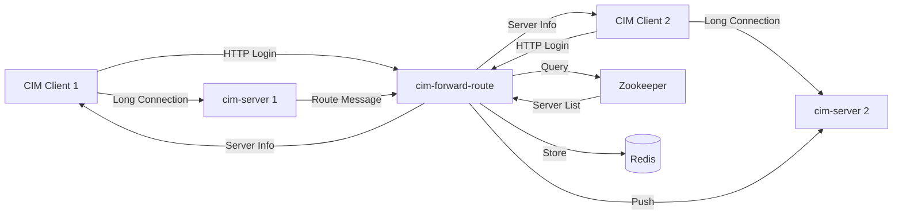

# CIM 仓库全面审计与优化计划

> 审计日期：2026-02-20
> 分支：`claude/audit-and-plan-Hemxj`

---

## 一、现状审计总览

### 1.1 项目基本信息

| 项目 | 值 |
|------|-----|
| 项目名称 | CIM (Cross-IM) |
| 构建工具 | Maven (多模块) |
| 主要语言 | Java 8 |
| 核心框架 | Spring Boot 1.5.6 + Netty 4.1.21 |
| 许可证 | MIT |
| Java 源文件总数 | 117 个 |
| 测试文件总数 | 10 个 |
| 测试覆盖率 | ~8.5% |

### 1.2 模块结构

```
Ware-Tim/
├── cim-common          # 公共工具模块（数据结构、协议、异常）
├── cim-server          # IM 服务端（Netty 长连接服务）
├── cim-forward-route   # 消息路由服务（无状态 REST 服务）
├── cim-client          # IM 客户端（命令行客户端）
├── cim-zk              # Zookeeper 集成模块
├── protocol/           # Protobuf 协议定义文件
├── script/             # 部署脚本
└── doc/                # 文档目录
```

### 1.3 技术栈

| 技术 | 版本 | 说明 |
|------|------|------|
| Spring Boot | 1.5.6.RELEASE | **严重过时**，当前最新 3.x |
| Netty | 4.1.21.Final | 过时，当前 4.1.100+ |
| Protobuf | 3.4.0 | 较新，当前 3.25+ |
| ZKClient | 0.1 | 极度过时 |
| Guava | 19.0 | 过时，当前 33.x |
| FastJSON | 1.2.31 | **存在安全漏洞**，需升级 |
| OkHttp | 3.3.1 | 过时，当前 4.12+ |
| JUnit | 4.12 | 过时，当前 JUnit 5 |

---

## 二、问题清单（按优先级）

### 🔴 高优先级（安全/稳定性）

#### P1-1：FastJSON 安全漏洞
- **位置**：所有模块的 `pom.xml`
- **问题**：FastJSON 1.2.31 存在多个已知 RCE（远程代码执行）漏洞（CVE-2017-18349 等）
- **建议**：升级至 1.2.83+ 或迁移到 Jackson/Gson

#### P1-2：外部服务地址硬编码
- **位置**：`cim-server/application.properties`、`cim-forward-route/application.properties`
- **问题**：Zookeeper 地址 (`47.98.194.60:2182`) 和 Redis 地址 (`47.98.194.60:6379`) 硬编码为生产环境 IP
- **影响**：本地开发需要手动修改配置；配置泄露安全风险
- **建议**：使用环境变量或 Profile 机制，提供本地开发默认值 `localhost`

#### P1-3：Redis 操作非原子性
- **位置**：`cim-forward-route/.../AccountServiceRedisImpl.java:178`
- **问题**：TODO 标注了需将多步 Redis 操作改为原子命令，存在数据一致性风险
- **建议**：使用 Redis Lua 脚本或 Pipeline/事务确保原子性

### 🟡 中优先级（质量/可维护性）

#### P2-1：测试覆盖率极低
- **现状**：117 个 Java 源文件，仅 10 个测试文件，覆盖率约 8.5%
- **缺失测试的核心模块**：
  - `CIMServer` / `CIMServerHandle`（核心连接逻辑）
  - `RouteController`（所有 REST 接口）
  - `SessionSocketHolder`（会话管理）
  - `ServerListListener`（ZK 监听器）
- **建议**：优先为业务逻辑层编写单元测试，目标覆盖率 ≥ 60%

#### P2-2：TODO 代码注释未处理（7处）

| 编号 | 位置 | 内容 | 优先级 |
|------|------|------|--------|
| 1 | `cim-forward-route/AccountServiceRedisImpl.java:178` | Redis 原子操作（数据一致性）| 高 |
| 2 | `cim-client/CIMClientHandle.java:79` | 重连后关闭定时任务（性能优化）| 中 |
| 3 | `cim-client/MsgHandle.java:30` | 消息处理重构为责任链模式 | 中 |
| 4 | `cim-client/AsyncMsgLogger.java:50` | 队列满时线程阻塞行为确认 | 中 |
| 5 | `cim-common/TrieTree.java:9` | 字典树前缀模糊匹配说明 | 低 |
| 6 | `cim-server/CIMServerHandle.java:28` | Netty 相关改进（描述模糊）| 低 |
| 7 | `cim-server/CIMServerInitializer.java:14` | Netty 相关改进（描述模糊）| 低 |

#### P2-3：依赖版本严重过时
- Spring Boot 1.5.6（EOL 已超过 6 年，2019年停止维护）
- 缺乏安全补丁，不支持现代 Java 特性
- 建议路径：1.5.x → 2.7.x（过渡）→ 3.2.x（目标）

#### P2-4：图片资源使用第三方 CDN
- **位置**：`README_CIM.md` 中约 20 张图片
- **问题**：使用 `ws4.sinaimg.cn` 等新浪微博 CDN，链接已大量失效
- **建议**：将图片迁移至 GitHub 仓库 `/doc/images/` 或使用 GitHub Issues 上传

### 🟢 低优先级（体验/功能增强）

#### P3-1：缺少容器化支持
- 无 `Dockerfile` 或 `docker-compose.yml`
- 本地启动需要手动安装和配置 Redis、Zookeeper
- **建议**：添加 Docker Compose 一键启动本地开发环境

#### P3-2：缺少 CI/CD 配置
- 无 `.github/workflows/` 目录（GitHub Actions）
- 无自动化构建/测试流程
- **建议**：添加 GitHub Actions workflow，实现 PR 自动测试

#### P3-3：未完成的功能
根据 README TODO LIST，以下功能尚未实现：
- [ ] 分组群聊
- [ ] Android SDK
- [ ] 离线消息
- [ ] 协议消息加密
- [ ] 更多客户端路由策略

---

## 三、优化计划

### Phase 1：安全加固（建议 1-2 周）

**目标**：消除安全风险，提升系统稳定性

```
Task 1.1 - 升级 FastJSON
  - 将 fastjson 版本从 1.2.31 升级到 1.2.83
  - 检查 API 兼容性，更新受影响的调用

Task 1.2 - 修复配置硬编码
  - 修改 cim-server/application.properties
    app.zk.addr=localhost:2181  # 改为默认值
  - 修改 cim-forward-route/application.properties
    app.zk.addr=localhost:2181
    spring.redis.host=localhost
  - 添加 application-prod.properties 用于生产配置
  - 更新部署文档，说明通过命令行参数覆盖

Task 1.3 - Redis 原子操作修复
  - 在 AccountServiceRedisImpl.java 中
    使用 Redis Lua 脚本确保登录/注册操作原子性
  - 解决 TODO: 2019-01-21 标注的数据一致性问题
```

### Phase 2：代码质量提升（建议 2-4 周）

**目标**：提高测试覆盖率，处理遗留 TODO

```
Task 2.1 - 补充单元测试（优先级排序）
  高优先：
  - RouteController（所有 REST 接口的集成测试）
  - AccountServiceRedisImpl（业务逻辑测试）
  - SessionSocketHolder（会话管理测试）
  中优先：
  - CIMClientHandle 重连逻辑测试
  - MsgHandle 消息处理测试
  低优先：
  - 工具类测试补全

Task 2.2 - 处理 TODO 注释
  - CIMClientHandle.java:79
    实现连接成功后关闭定时任务逻辑
  - MsgHandle.java:30
    将 if-else 消息处理重构为 Chain of Responsibility 模式
  - AsyncMsgLogger.java:50
    明确 LinkedBlockingQueue.put() 阻塞行为并添加注释

Task 2.3 - 代码规范改进
  - 统一日志格式（使用 SLF4J + Logback 参数化日志）
  - 移除无用的 System.out.println（如有）
  - 统一异常处理（全局 ExceptionHandler）
```

### Phase 3：基础设施现代化（建议 4-8 周）

**目标**：提升开发体验，降低上手门槛

```
Task 3.1 - 添加 Docker Compose
  创建 docker-compose.yml 包含：
  - Redis 服务
  - Zookeeper 服务
  - cim-server 服务
  - cim-forward-route 服务
  一条命令启动完整开发环境

Task 3.2 - 添加 GitHub Actions CI
  .github/workflows/build.yml：
  - Push/PR 触发
  - Java 8 环境
  - mvn test
  - 构建验证

Task 3.3 - Spring Boot 版本升级路径
  第一步：1.5.6 → 2.7.x（保持 Java 8 兼容）
  第二步：2.7.x → 3.2.x（迁移到 Java 17）
  注意：需同步更新 Netty、ZKClient 等依赖
```

### Phase 4：文档补充（建议 2-3 周，可并行）

详见下方第四章。

---

## 四、文档补充计划

### 4.1 现有文档评估

| 文件 | 现状 | 评分 |
|------|------|------|
| `README.md` | 仅有 `# CIM` 标题，几乎为空 | 1/10 |
| `README_CIM.md` | 内容较全但图片大量失效 | 6/10 |
| `doc/QA.md` | 覆盖基本问题，但不够全面 | 5/10 |
| API 文档 | 依赖 Swagger，无离线文档 | 3/10 |
| 架构文档 | 嵌在 README_CIM.md 中，不独立 | 4/10 |
| 开发者指南 | 缺失 | 0/10 |

### 4.2 文档补充任务

#### Doc-1：重写 README.md（高优先级）

将 `README.md` 重写为项目门户，内容包含：

```markdown
结构：
1. 项目徽章（Build Status, License, Version）
2. 项目简介（中英双语）
3. 核心特性列表
4. 架构图（迁移到仓库内图片）
5. 快速开始（使用 Docker Compose）
6. 模块说明（简短，链接到详细文档）
7. 贡献指南链接
8. License 信息
```

#### Doc-2：创建 CONTRIBUTING.md（中优先级）

内容包含：
- 开发环境搭建（本地 + Docker）
- 代码规范说明
- PR 提交流程
- Issue 提交规范
- 代码审查清单

#### Doc-3：创建 doc/ARCHITECTURE.md（高优先级）

内容包含：
- 系统整体架构图（Mermaid 绘制，无需外部 CDN）
- 各模块职责说明
- 数据流说明（登录流程、消息路由流程）
- 部署架构（单机、集群）
- 技术选型说明（为什么选 Netty、Zookeeper 等）



#### Doc-4：完善 doc/QA.md（中优先级）

补充以下内容：
- Docker 方式启动的常见问题
- Zookeeper 连接失败排查
- Redis 连接失败排查
- 客户端自动重连机制说明
- 心跳超时配置说明
- 集群部署注意事项

#### Doc-5：创建 doc/API.md（中优先级）

为 `cim-forward-route` 的 REST 接口提供离线 API 文档：

| 接口 | 方法 | 说明 |
|------|------|------|
| `/registerAccount` | POST | 注册用户账号 |
| `/login` | POST | 用户登录，返回分配的服务器信息 |
| `/groupRoute` | POST | 群聊消息路由 |
| `/p2pRoute` | POST | 私聊消息路由 |
| `/offLine` | POST | 用户下线 |
| `/onlineUser` | GET | 获取在线用户列表 |

每个接口包含：请求参数、请求示例（curl）、响应示例、错误码说明

#### Doc-6：创建 doc/DEPLOYMENT.md（高优先级）

将 README_CIM.md 中的部署内容独立出来，补充：
- 环境要求（Java 版本、内存建议）
- 单机部署完整步骤
- 集群部署完整步骤（含 Nginx 配置示例）
- Docker Compose 部署（新增）
- 配置参数完整说明表
- 监控与运维（Actuator 端点说明）
- 升级指南

#### Doc-7：修复 README_CIM.md 图片链接（高优先级）

- 将所有 `ws4.sinaimg.cn` 图片下载并上传到 `/doc/images/`
- 更新文档中的图片引用路径为相对路径

### 4.3 文档交付时间表

```
Week 1（立即开始）：
  - Doc-7: 修复图片链接（优先保证文档可读性）
  - Doc-1: 重写 README.md

Week 2：
  - Doc-3: 创建 ARCHITECTURE.md
  - Doc-6: 创建 DEPLOYMENT.md

Week 3：
  - Doc-5: 创建 API.md
  - Doc-4: 完善 QA.md
  - Doc-2: 创建 CONTRIBUTING.md
```

---

## 五、技术债清单（汇总）

### 5.1 已识别技术债

| ID | 类型 | 描述 | 影响 | 修复成本 |
|----|------|------|------|---------|
| TD-001 | 安全 | FastJSON 存在 RCE 漏洞 | 高 | 低 |
| TD-002 | 安全 | 生产 IP 硬编码到配置文件 | 中 | 低 |
| TD-003 | 稳定 | Redis 非原子操作（数据一致性） | 高 | 中 |
| TD-004 | 质量 | 测试覆盖率 8.5% | 高 | 高 |
| TD-005 | 维护 | Spring Boot 1.5.6（EOL） | 中 | 高 |
| TD-006 | 维护 | 7 个未处理 TODO 注释 | 低 | 低-中 |
| TD-007 | 体验 | 无容器化支持 | 低 | 低 |
| TD-008 | 文档 | README.md 几乎为空 | 中 | 低 |
| TD-009 | 文档 | 20+ 图片链接失效 | 中 | 低 |
| TD-010 | 功能 | 5 个 TODO LIST 功能未实现 | 低 | 高 |

### 5.2 修复优先级矩阵

```
影响高 + 修复成本低（立即处理）：
  ✅ TD-001: 升级 FastJSON
  ✅ TD-002: 修复硬编码配置
  ✅ TD-008: 重写 README.md
  ✅ TD-009: 修复图片链接

影响高 + 修复成本中（计划处理）：
  📋 TD-003: Redis 原子操作
  📋 TD-006: 处理 TODO 注释

影响中 + 修复成本高（长期规划）：
  🗓️ TD-004: 提升测试覆盖率
  🗓️ TD-005: Spring Boot 升级
```

---

## 六、实施建议

### 6.1 短期行动（本周内）

1. **升级 FastJSON** - 30 分钟，立即消除安全风险
2. **修复配置硬编码** - 1 小时，改善本地开发体验
3. **重写 README.md** - 2 小时，提升项目可发现性
4. **修复图片链接** - 2 小时，恢复文档可读性

### 6.2 中期行动（1-2 个月内）

1. **补充单元测试** - 覆盖核心业务逻辑
2. **处理 TODO 注释** - 特别是 Redis 原子操作
3. **添加 Docker Compose** - 降低贡献门槛
4. **完善文档体系** - 创建独立的架构/部署/API 文档

### 6.3 长期规划（3-6 个月）

1. **Spring Boot 升级路径** - 1.5.6 → 2.7.x → 3.2.x
2. **实现 TODO LIST 功能** - 离线消息、消息加密等
3. **建立 CI/CD 流程** - GitHub Actions 自动化测试

---

## 七、参考资料

- [Spring Boot 版本支持时间线](https://spring.io/projects/spring-boot#support)
- [FastJSON 安全公告](https://github.com/alibaba/fastjson/wiki/security_update_20220523)
- [Netty 迁移指南](https://netty.io/wiki/new-and-noteworthy.html)
- [Redis 事务与 Lua 脚本](https://redis.io/docs/manual/transactions/)
- [GitHub Actions Java 工作流](https://docs.github.com/en/actions/automating-builds-and-tests/building-and-testing-java-with-maven)
